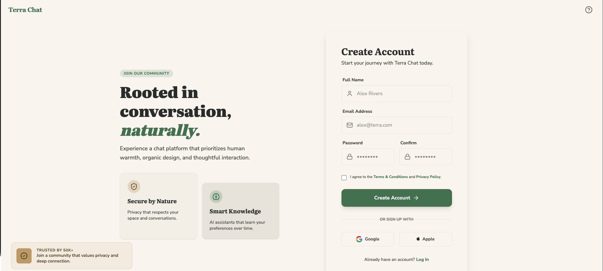
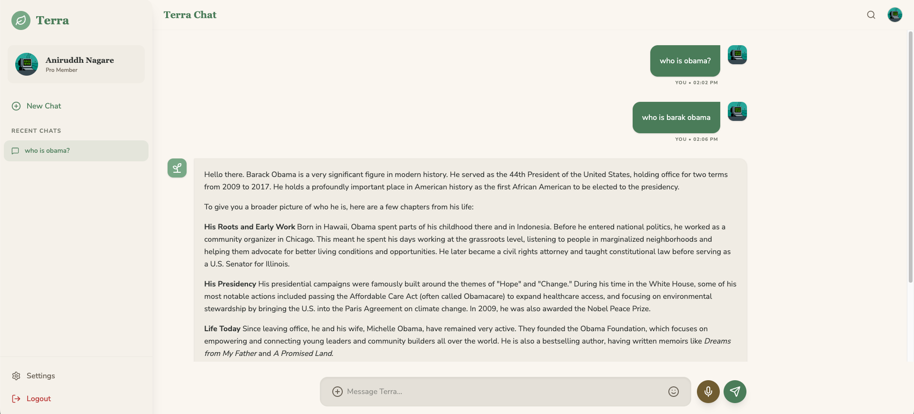
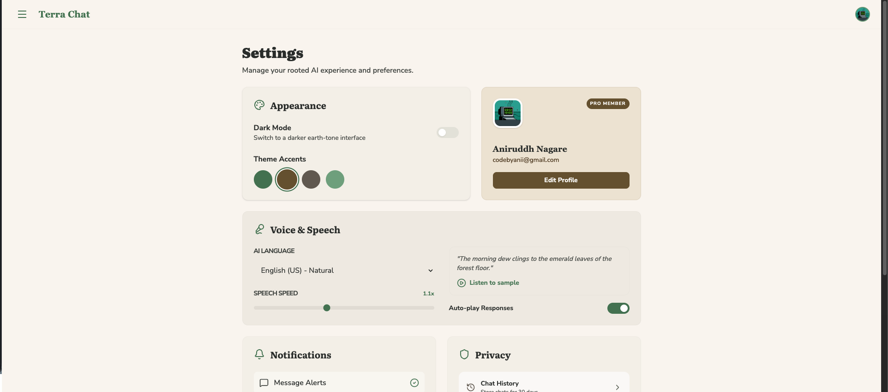

# Terra Chat

Terra Chat is a "grounded" chat experience built with React + Vite, using:

- Gemini (via `@google/genai`) for generating assistant replies
- Firebase Auth (Google sign-in) for authentication
- Firestore for storing users, chat sessions, and chat messages

## Screenshots








## Set up locally

### Prerequisites

- Node.js (LTS recommended)

### 1) Install dependencies

```bash
npm install
```

### 2) Configure environment variables

Copy the example file and set your Gemini API key:

```bash
cp .env.example .env.local
```

Update `GEMINI_API_KEY` in `.env.local`.
(`APP_URL` is primarily used by the hosted/AI Studio runtime; local dev can usually leave it as-is.)

### 3) Firebase configuration

This repo includes `firebase-applet-config.json`, which the app uses to initialize Firebase (Auth + Firestore).

If you want to run against your own Firebase project, update `firebase-applet-config.json` accordingly (and ensure your Firestore security rules allow the reads/writes the app needs).

The app expects these Firestore structures:

- `users/{uid}`: user profile document (including `settings`)
- `chats/{chatId}`: chat session documents (including `userId`, `title`, `lastMessage`, `createdAt`, `updatedAt`)
- `chats/{chatId}/messages/{messageId}`: chat message documents (including `role`, `content`, optional `thinking`, `createdAt`)

### 4) Run the dev server

```bash
npm run dev
```

The app should be available at `http://localhost:3000`.

## Build & preview

```bash
npm run build
npm run preview
```

## Notes

- The app uses Vite with Tailwind (`npm run dev` uses `vite --port=3000 --host=0.0.0.0`).
- API calls will fail until `GEMINI_API_KEY` is set (see `src/services/geminiService.ts`).
